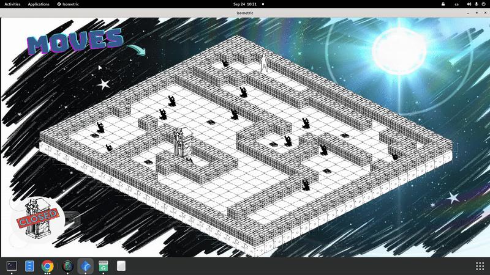

<div align="center">

# so_long

**A 2D isometric tile-based game developed in C as part of the 42 School curriculum**

*The player must collect all collectibles and find the exit while avoiding enemies that patrol the map*

---

</div>

## Demo
<div align="center">



*Navigate, collect, survive - while avoiding intelligent patrolling enemies*

</div>

---

## Objective

Navigate through the map, collect all collectibles (`C`), and reach the exit (`E`) while avoiding patrolling enemies. The game features an **isometric view** with smooth animations and **intelligent enemy AI**.

---

## Controls

<div align="center">

| Key | Action | Key | Action |
|:---:|:------:|:---:|:------:|
| **W** | Move Up | **A** | Move Left |
| **S** | Move Down | **D** | Move Right |
| **↑** | Move Up | **←** | Move Left |
| **↓** | Move Down | **→** | Move Right |
| **ESC** | Exit Game | **Q** | Exit Game |

</div>

---

## Installation

<details>
<summary><b>Prerequisites</b></summary>

- **MLX42** graphics library
- **Make** build system
- **GCC** compiler
- **CMake** (for MLX42 compilation)

</details>

### MLX42 Installation

```bash
# Clone MLX42 library
git clone https://github.com/codam-coding-college/MLX42.git
cd MLX42

# Build the library
cmake -B build
cmake --build build -j4
# Install (optional, or link directly in your Makefile)
```

> **Note**: Make sure MLX42 is either installed system-wide or the path in the Makefile points to your local MLX42 build directory.

### Build & Run

```bash
# Clone the repository
git clone https://github.com/Delregne00/solong.git
cd solong

# Compile the project
make

# Run the game
./so_long maps/map.ber
```

---

## Map Format

Maps use the `.ber` extension with the following elements:

<div align="center">

| Symbol | Element | Description |
|:------:|:-------:|:-----------:|
| `0` | Empty space / Floor | Walkable tiles |
| `1` | Wall | Solid barriers |
| `P` | Player starting position | Spawn point (exactly one) |
| `C` | Collectible | Items to gather |
| `E` | Exit | Goal destination (exactly one) |
| `X` | Enemy spawn point | Hostile patrol units |

</div>

### Map Requirements

<table>
<tr>
<td width="50%">

**Structure Rules:**
- Must be rectangular
- Surrounded by walls (`1`)
- Exactly one player (`P`) and one exit (`E`)
- At least one collectible (`C`)

</td>
<td width="50%">

**Gameplay Rules:**
- Must be solvable
- Path must exist from P to E
- All collectibles must be reachable
- No isolated areas

</td>
</tr>
</table>

---

## System Architecture

The project implements a **modular architecture** centered around the `t_game` structure that coordinates between five specialized subsystems:

<details>
<summary><b>Core Data Structures</b></summary>

### **t_game** - Central game state coordinator
- Map data and player position tracking
- Sprite management and animation systems
- MLX instance and rendering context
- Move counter and game completion status

### **t_map** - World representation system
- 2D grid array for tile-based world storage
- Player coordinates (x, y) with collision boundaries
- Dynamic collectible tracking and validation
- Enemy spawn points and patrol route definitions

### **t_sprites** - Graphics asset management
- MLX texture loading and caching system
- Multi-frame sprite animations with timing control
- Isometric sprite positioning and depth sorting
- Memory-efficient texture atlas organization

### **t_tomb** - Animation controller
- Frame sequencing for character animations
- Frame counter for timing synchronization
- State-based animation transitions
- Sprite cycling for dynamic visual effects

### **t_iso_coords** - Coordinate transformation system
- Cartesian to isometric projection mathematics
- Wall collision detection in isometric space
- Movement vector calculations and validation
- Screen position mapping for rendering pipeline

</details>

<details>
<summary><b>Rendering Pipeline</b></summary>

The graphics system implements a sophisticated **isometric rendering pipeline**:

1. **Coordinate Transformation**: Cartesian grid coordinates are converted to isometric screen positions using matrix transformations
2. **Depth Sorting**: Sprites are rendered back-to-front based on their grid position to ensure proper visual layering
3. **Animation Management**: Multi-frame sprites are cycled through their animation sequences with precise timing control
4. **Collision Visualization**: Real-time collision boundaries are calculated and can be toggled for debugging

</details>

<details>
<summary><b>Enemy AI System</b></summary>

The enemy subsystem implements **autonomous patrolling behavior**:

- **Path Planning**: Enemies calculate valid movement routes within map boundaries
- **Collision Avoidance**: Dynamic obstacle detection prevents enemies from moving through walls or other entities
- **State Machine**: Each enemy maintains internal state for patrol direction, position validation, and player proximity detection
- **Synchronized Updates**: Enemy positions are updated in coordination with the main game loop to maintain consistent 60fps performance

</details>

<details>
<summary><b>Input Processing</b></summary>

The input system handles **real-time player interaction** through:

- **Event Capture**: MLX42 key events are captured and processed through the main game loop
- **Movement Validation**: Each input is validated against map boundaries and collision detection before execution
- **State Updates**: Player position, animation state, and game statistics are updated atomically
- **Exit Conditions**: Game completion logic is triggered when all collectibles are gathered and exit is reached

</details>

---

## Performance & Quality

### Performance Optimizations
- **-Ofast** compiler optimization for maximum performance
- Efficient sprite caching and memory management
- Optimized rendering pipeline for smooth 60fps gameplay
- Smart enemy update cycles to reduce CPU overhead

### Testing and Validation
The project includes comprehensive validation:
- Map format verification
- Accessibility checking (ensuring all collectibles are reachable)
- Border validation
- Memory leak detection
- Error handling for invalid inputs

---

## Documentation

For detailed technical documentation about the implementation:

**[Complete Technical Wiki](https://deepwiki.com/Delregne00/solong/1-overview)**

<details>
<summary><b>The wiki covers:</b></summary>

- Detailed architecture and system relationships
- Core game system implementation
- libft utility library documentation
- ft_printf custom formatting system
- Advanced rendering techniques
- Enemy AI algorithms

</details>

---

## Built With

<table>
<tr>
<td width="50%">

**Core Technologies:**
- **Language**: C (C99 standard)
- **Graphics**: MLX42 library for cross-platform graphics
- **Build System**: Custom Makefile with automated dependency management

</td>
<td width="50%">

**Custom Libraries:**
- **libft**: Custom utility library
- **ft_printf**: Custom formatting system

</td>
</tr>
</table>

---

## Development Environment

### Project Structure
```
solong/
├── src/					# Core game source files
├── includes/				# Header files and definitions
├── maps/					# Game level files (.ber format)
├── assets/					# Sprites and game resources
├── libft/					# Custom utility library
├── demo/					# Gameplay videos and screenshots
└── Makefile			   # Build configuration
```

### Build Targets
```bash
make		  # Build the main executable
make clean	  # Remove object files
make fclean   # Full clean (remove all generated files)
make re		  # Rebuild everything from scratch
```

---

## Key Features

<div align="center">

**Smooth Gameplay** • **Isometric Graphics** • **Intelligent AI** • **Performance Monitoring** • **Map Validation** • **Memory Management**

</div>

<table>
<tr>
<td width="50%">

**Gameplay Features:**
- 60fps with responsive controls
- 2D sprites rendered in isometric perspective
- Enemies with patrol patterns and collision detection
- Move counter and completion tracking

</td>
<td width="50%">

**Technical Features:**
- Comprehensive error checking and validation
- Zero memory leaks with proper resource cleanup
- Real-time collision detection
- Modular, maintainable code architecture

</td>
</tr>
</table>

---

## 42 School Requirements

This project fulfills **all requirements** for the **so_long** project at 42 School:

<div align="center">

| Requirement | Status |
|:------------|:------:|
| Use MLX library for graphics | ✅ |
| Implement player movement with WASD/arrows | ✅ |
| Count and display moves | ✅ |
| Collect all items before accessing exit | ✅ |
| Handle window close and ESC key | ✅ |
| Validate map format and accessibility | ✅ |
| No memory leaks | ✅ |
| Proper error handling | ✅ |

</div>

---

<div align="center">

**Developed by [Delregne00] as part of the 42 School curriculum**

</div>
